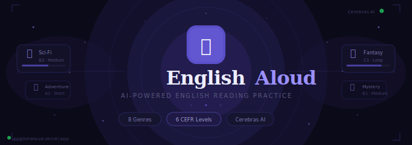
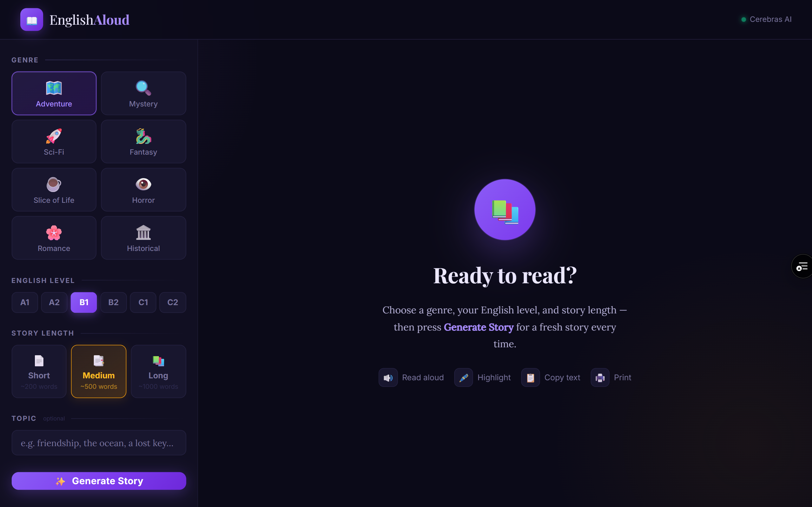
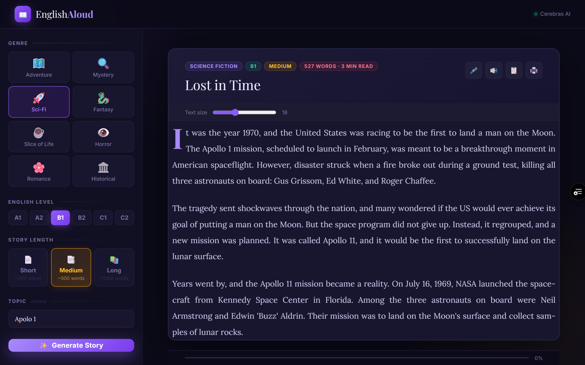
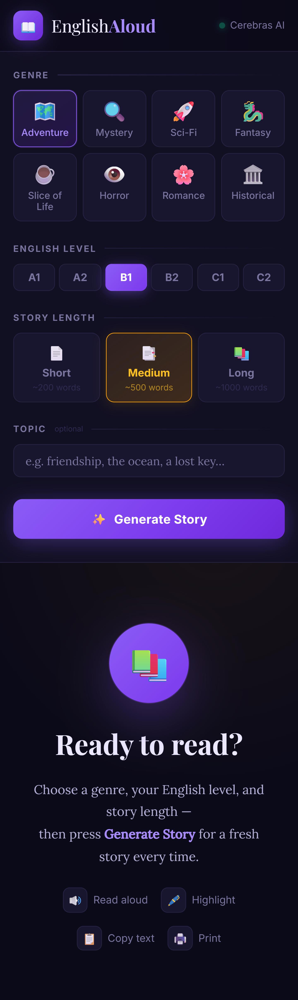
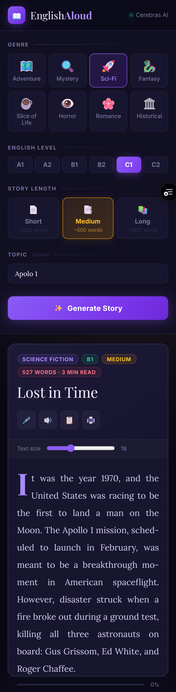

# 📖 EnglishAloud

<p align="center">
  
</p>

<p align="center">
  <strong>AI-Powered English Reading Practice</strong><br>
  Generate custom short stories tailored to your level — instantly, for free.
</p>

<p align="center">
  
  
  
  
  
</p>

<p align="center">
  <a href="#-what-is-it">About</a> •
  <a href="#-features">Features</a> •
  <a href="#-preview">Preview</a> •
  <a href="#-how-to-use">How to Use</a> •
  <a href="#-tech-stack">Tech Stack</a> •
  <a href="#-deploy">Deploy</a> •
  <a href="#-run-locally">Local Dev</a>
</p>

<p align="center">
  🌐 <strong><a href="https://englishaloud.vercel.app">englishaloud.vercel.app</a></strong>
</p>

---

# ✨ What is it?

**EnglishAloud** is a web app that generates original English short stories tailored to your CEFR level and interests. Designed for English learners who want engaging, level-appropriate reading material on demand — no account, no install, no cost.

Just pick a genre, choose your level, and get a story in seconds.

---

# 🎯 Features

<div align="center">

| Feature | Description |
|---|---|
| 🤖 **AI-generated stories** | Fresh, original stories every time via Cerebras AI (Llama 3.1 8B) |
| 📚 **8 genres** | Adventure, Mystery, Sci-Fi, Fantasy, Slice of Life, Horror, Romance, Historical |
| 🎓 **6 CEFR levels** | A1 through C2 — vocabulary and complexity adapt automatically |
| 📏 **3 story lengths** | Short (~200 words), Medium (~500 words), Long (~1000 words) |
| 💬 **Custom topic** | Steer the story with a keyword — "the ocean", "a lost key", anything |
| 🔊 **Read aloud** | Browser-native text-to-speech at a comfortable reading pace |
| 🖊️ **Word highlight** | Click any word to mark it while reading |
| 📋 **Copy & Print** | Copy the full story to clipboard or print a clean version |
| 🔡 **Font size control** | Adjust reading size from the story toolbar |
| 📊 **Reading progress bar** | Tracks your scroll position through the story |
| 📱 **Fully responsive** | Works on desktop, tablet, and mobile |

</div>

---

# 🖼️ Preview

## 🏠 Home — Story Generator

<p align="center">
  
</p>

---

## 📖 Story View || 🎓 CEFR Level Selector

<p align="center">
  
</p>

---

## 📱 Mobile View

<p align="center">
  
  &nbsp;&nbsp;
  
</p>

---

# 🚀 How to Use

### Step-by-step

**1.** Open the app at **[englishaloud.vercel.app](https://englishaloud.vercel.app)**

**2.** Pick a **genre** from the tile grid in the sidebar

**3.** Select your **English level** using the CEFR chip buttons

> `A1` Beginner → `A2` Elementary → `B1` Intermediate → `B2` Upper-Intermediate → `C1` Advanced → `C2` Proficiency

**4.** Choose a **story length** — Short, Medium, or Long

**5.** *(Optional)* Enter a **topic keyword** to give the story a specific theme

**6.** Press **Generate Story** and wait a few seconds ✨

**7.** Once the story appears, use the toolbar to:

| Button | Action |
|---|---|
| 🔊 | Read the story aloud |
| 🖊️ | Enter highlight mode — click any word to mark it |
| 📋 | Copy the full story text to clipboard |
| 🖨️ | Print a clean, ink-friendly version |
| 🔡 | Drag the slider to adjust font size |

---

# 🧱 Tech Stack

<div align="center">

| Layer | Technology |
|---|---|
| 🖥️ **Frontend** | Vanilla HTML / CSS / JavaScript — zero dependencies |
| 🤖 **AI Model** | Cerebras AI — `llama3.1-8b` |
| ☁️ **Hosting** | Vercel Serverless Functions (Node.js) |
| 🔊 **Text-to-Speech** | Web Speech API — browser-native |
| 🔠 **Fonts** | Playfair Display, Lora, Inter via Google Fonts |

</div>

No framework, no build step, no bloat — just fast, clean web fundamentals.

---

# 🧩 Project Structure

```
EnglishAloud/
├── index.html          # The entire frontend — one file
├── api/
│   └── generate.js     # Vercel serverless function — proxies Cerebras API
├── docs/
│   ├── assets/
│   │   └── banner.png
│   └── screenshots/
│       ├── home.png
│       ├── story-view.png
│       ├── level-selector.png
│       ├── mobile.png
│       └── mobile-story.png
└── README.md
```

> 🔐 **The API key never touches the browser.** The frontend calls `/api/generate`, the serverless function reads the key from Vercel's environment variables, and forwards the request to Cerebras.

---

# ☁️ Deploy to Vercel

### 1️⃣ Push to GitHub

```bash
git add .
git commit -m "initial commit"
git push
```

---

### 2️⃣ Import into Vercel

Go to [vercel.com/new](https://vercel.com/new), import your GitHub repository, and click **Deploy** — no build settings needed.

---

### 3️⃣ Add the Environment Variable

In your Vercel project: **Settings → Environment Variables**

| Name | Value |
|---|---|
| `CEREBRAS_API_KEY` | Your key from [cloud.cerebras.ai](https://cloud.cerebras.ai) |

---

### 4️⃣ Redeploy

Trigger a new deployment from the Vercel dashboard. The app is now live with the key safely stored server-side. ✅

---

# 💻 Run Locally

```bash
# Install the Vercel CLI (once)
npm i -g vercel

# Create a local .env file with your key
echo "CEREBRAS_API_KEY=your-key-here" > .env.local

# Start the local dev server (runs both HTML and the serverless function)
vercel dev
```

> ⚠️ The `.env.local` file is already ignored by Vercel's default `.gitignore` rules. **Never commit it.**

---

# 📄 License

This project is licensed under the **MIT License** — free to use, modify, and distribute.

---

# 👨‍💻 Author

Built by **Abdair Magdiel Coca Carlo**

- GitHub: [@abdair-coca](https://github.com/abdair-coca)
- Live: [englishaloud.vercel.app](https://englishaloud.vercel.app)

---

<p align="center">
  <strong>Built with Cerebras AI ⚡ + vanilla web 🌐 — stories that adapt to you 📖✨</strong>
</p>